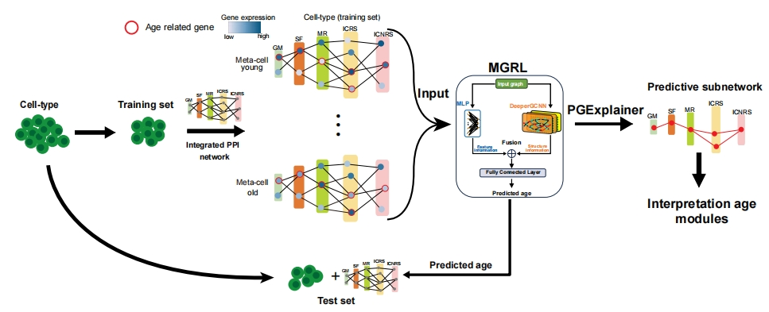

# An explainable AI analysis of single-cell and epigenetic data reveals novel molecular insights in aging



<!-- TABLE OF CONTENTS -->
<details open="open">
  <summary><h2 style="display: inline-block">Table of Contents</h2></summary>
  <ol>
    <li>
      <a href="#Requirements">Requirements</a>
    </li>
    <li>
      <a href="#getting-started">Getting Started</a>
    </li>
    <li><a href="#usage">Usage</a></li>
    <li><a href="#example-demo">Example Demo</a></li>
    <li><a href="#cite-agingxai">Cite agingXAI</a></li>
  </ol>
</details>

<!-- Requirements -->
## Requirements

+ Linux/UNIX/Windows system
+ Python >= 3.7
+ torch == 1.12.1
+ torch-geometric == 2.3.1

<!-- GETTING STARTED -->
## Getting Started


### Installation

1. Clone the repo
   ```sh
   git clone https://github.com/Frank-qlu/agingXAI.git
   ```
2. Create conda environment
   ```sh
   conda create -n agingXAI python=3.7.13
   conda install pytorch==1.12.1 torchvision==0.13.1 torchaudio==0.12.1 cudatoolkit=11.3 -c pytorch
   ```
3. Install dependencies
   ```sh
   pip install -r requirements.txt
   ```

## Usage

### Step 1: Data preparation
+ `ppi_of_{dataName}.csv`: PPI network of the dataset for describing relationships between genes.
+ `expression_of_{dataName}.csv` : Describing the expression values of the genes where each cell is located. The rows represent cells and the columns represent the expression values of the genes on the cells. The row index [0,m] is the train data, and the column index [m,n] is the test data. 
+ `information_of_{dataName}.csv`: Describing the details of each cell, such as donor_id, sex, age, etc. 
+ `signalingLayer_of_{dataName}.csv`: Describing the category in which the genes are located, and categorize the genes into 5 classes.

### Step 1: Data processing
Processing and transforming raw graph data into PYG graph Data objects
```
data_process.ipynb
```

#### Input:

+ `ppi_of_{dataName}.csv`: PPI network of the dataset for describing relationships between genes.
+ `expression_of_{dataName}.csv` : Describing the expression values of the genes where each cell is located.
+ `information_of_{dataName}.csv`: Describing the details of each cell, such as donor_id, sex, age, etc.
+ `signalingLayer_of_{dataName}.csv`: Describing the category in which the genes are located, and categorize the genes into 5 classes.

#### Output:

+ `{dataName}_pyg.pt` : pyg DATA objects format

### Step 2: Train the model

```py
python train.py
```
#### Input:

+ `{dataName}_pyg.pt` : pyg DATA objects format

#### Output:

+ `{dataName}_best_model.pt` : The optimal model weighting parameters.

### Step 3: Test the model 
Test the model and extract important nodes and edges

```py
python test.py
```

#### Input:

+ `{dataname}_best_model.pt`: The optimal model weighting parameters.

#### Output:

+ `{dataname}_agePrediction.csv` : Predicting the age of cells.


### Step 4:  Model interpretability1 
Extract indexes of the important nodes and edges that affect the prediction  

```py
python xai.py
```
#### Input:

+ `{dataname}_best_model.pt`: The optimal model weighting parameters.

#### Output:

+ `{dataname}_explain_nodes_index.txt` : Extracting the index of the important nodes.
+ `{dataname}_explain_edges_index.txt` : Extracting the index of the important nodes and edges between nodes

### Step 5: Model interpretability2

Convert to actual nodes based on index
```py
edgesExaction.ipynb
```

#### Input:

+ `{dataname}_explain_edges_index.txt` : Extracting the index of the important nodes and edges between nodes.

#### Output:

+ `{dataname}_explain_edges.csv` :  Converting to nodes based on index.

<!-- EXAMPLE DEMO -->
## Example Demo

[Guided Tutorial](example/tutorial.ipynb)

## Cite agingXAI
If you find agingXAI useful for your research, please consider citing the following paper:
```
@article{
  title={An explainable AI analysis of single-cell and epigenetic data reveals novel molecular insights in aging},
  author={Zhi-Peng Li, Zhaozhen Du, De-Shuang Huang, and Andrew E Teschendorff},
  journal={Submitted to Nature Computational Science},
  year={2024}
}
```